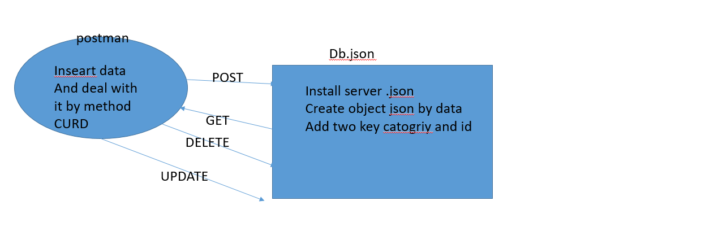

# api-server
## Dynamic API

Author: **bayan alalem**

 [git hub link](https://github.com/bayan-97/api-server) 

- installed REQUIER:

i install  ` npm install -g json-server `

### detailes about files 

- **db.json**

we built0  a working API Server using json-server
Install json-server on my computer
my  data models
`{ "categories" : [], "products": [] }`
i startrd json-server from within my working folder and “watch” your database file
`json-server --watch ./data/db.json`
my  api will automatically respond to the following endpoints:
/categories GET, POST
/categories/:id/ PUT, DELETE
/products GET, POST
/products/:id/ PUT, DELETE

## Running the app

by write `json-server --watch ./data/db.json` commint
will add data to db.json

### Swagger documentation:

[documentation:
](https://app.swaggerhub.com/apis/bayan-97/doces-server1/0.1#/)

and here process data flow
)
