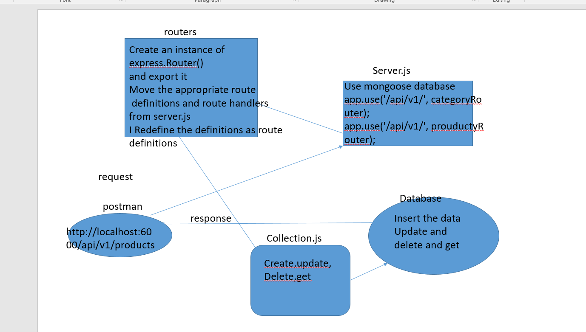

LAB - 8 

Author: bayan alalem

Setup
`.env `requirements
PORT - Port Number
`npm i -D jest ` `npm init -y` `npm i express` `npm i supertest` `npm i mongoose morgn cors` 

## detailes about files
### index.js
1- Require the mongoose library
 calling start() on my imported server module, it connect to Mongo, via mongoose
Prepare the server.js for modularization.

2- Require the category and product router modules 
3- app.use() each them in your app so that your routes will respond
4- Write new routing modules for your server

### routes/categories.js and routes/product.js

1- Create a router module for each of your data types
In each
2- Create an instance of express.Router() and export it

3 Move the appropriate route definitions and route handlers from server.js here

4- Redefine the definitions as route definitions 

## Begin the conversion from memory data to persistent data …
Import and initialize the appropriate Mongoose Collection (see bullet points below)
In your handler methods, rather than change your in-memory data store, call the appropriate model methods
Add Persistence with Mongoose Collections.

Work in lib/models/categories and lib/models/products

For each, create both a schema and collection file

. categories.schema.js and categories.collection.js

#The schema file should define your data model as a Mongoose schema
The collection file should be a class that:
Imports the schema

Exports a class with CRUD methods, coded to work with your schema
read() performs a find() query in your schema
create() performs a save() query in your schema for a new record
update() performs a findOneByIdAndUpdate() operation in your schema for an existing record
delete() performs a findOneByIdAndDelete() in your schema for a new record

## Running the app

`npm start`

Endpoint:`/products`

method:post
Returns Object

`{`
`  "name": "john-api-server.demo.herokuapp.com",`
`  "catogry": "running",`
`  "description": "color of skirt blue",`
 ` "id":1`
`}`
Endpoint:`/products`
method:get
Returns Object

`{`
    `"count": 1,`
   ` "results": {`
       ` "categories": [`
           ` {`
                `"name": "bayan3",`
               ` "display_name": "display_name,description",`
                `"description": "DD",`
               ` "id": 1`
            `}`
       ` ],`
        `"products": [`
           `  {`
               ` "name": "bayan3",`
                `"catogery": "display_name,description",`
               ` "description": "DD",`
               ` "id": 1`
           ` }`
        `]`
    `}`
`}`

Endpoint:`/products/1`
method:put
Returns Object

`{`
  `"name": "john-api-server.demo.herokuapp.com",`
 ` "catogry": "running",`
 ` "description": "color of skirt orange",`
 ` "id":1`
`}`

Endpoint:`/products/1`
method:`delete`
Returns Object

`{`
`}`

Endpoint:`/categories`

method:post
Returns Object

`{`
`  "name": "john-api-server.demo.herokuapp.com",`
`  "catogry": "running",`
`  "description": "color of skirt blue",`
 ` "id":1`
`}`
Endpoint:`/categories`
method:get
Returns Object

`{`
    `"count": 1,`
   ` "results": {`
       ` "categories": [`
           ` {`
                `"name": "bayan3",`
               ` "display_name": "display_name,description",`
                `"description": "DD",`
               ` "id": 1`
            `}`
       ` ],`
        `"categories": [`
           `  {`
               ` "name": "bayan3",`
                `"catogery": "display_name,description",`
               ` "description": "DD",`
               ` "id": 1`
           ` }`
        `]`
    `}`
`}`

Endpoint:`/categories/1`
method:put
Returns Object
    ` {`
                `"name": "bayan3",`
               ` "display_name": "display_name,description",`
                `"description": "DD",`
               ` "id": 1`
            `}`

Endpoint:`/categories/1`
method:`delete`
Returns Object

`{`
`}`

Tests
Unit Tests: npm run test

UML Diagram
