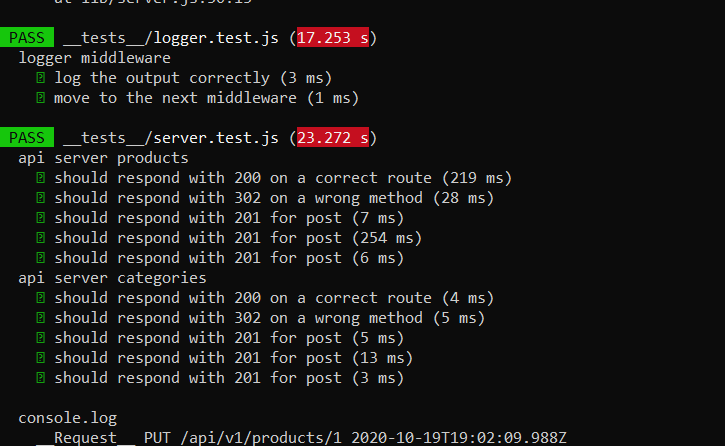
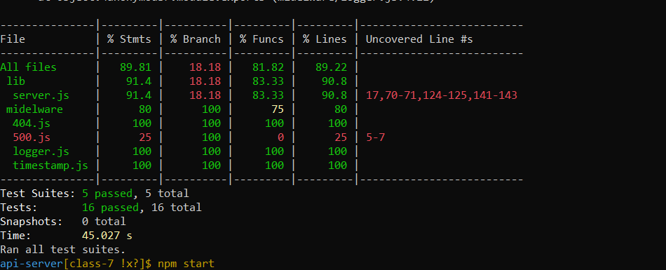
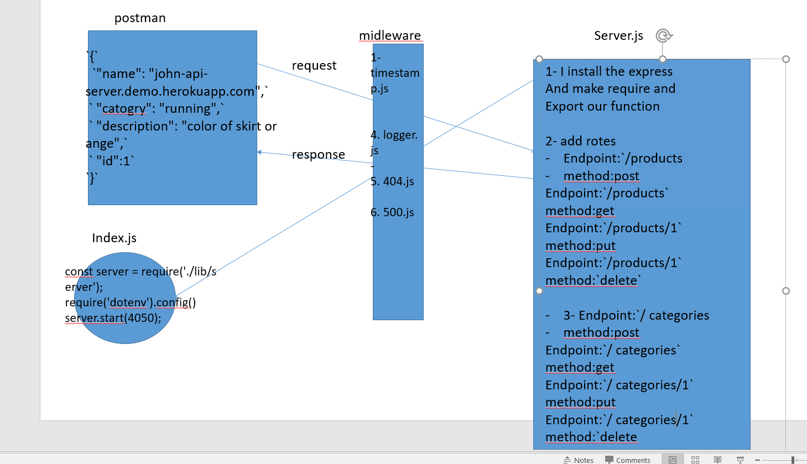

LAB - 7

Author: bayan alalem

Setup
`.env `requirements
PORT - Port Number
`npm i -D jest ` `npm init -y` `npm i express` `npm i supertest`

## detailes about files

1. index.js 

- it is acting  as the “entry point” to your server.
-  reading PORT from your .env file
- It should call the .start() method from the server with the PORT set in your environment

2. server.js 

 - contain all of the logic for the server
- we  export an object with a start() method 

3. timestamp.js
- we put the current timestamp on the request object in a property called requestTime
- Import this into your server and set it up to run at the application level for all routes

4. logger.js
- Execute a console.log() containing the request path, method, and the requestTime property of the request object
- Import this into your server and set it up to run at the application level for all routes

5. 404.js
- Sends a 404/Not-Found message as the response 
- Import this into your server and set it up to be “used” after your other routes

6. 500.js
- Sends a 500/Server Error message as the response 
- Import this into your server and set it up to be “used” as the last route

## Running the app

`npm start`

Endpoint:`/products`

method:post
Returns Object

`{`
`  "name": "john-api-server.demo.herokuapp.com",`
`  "catogry": "running",`
`  "description": "color of skirt blue",`
 ` "id":1`
`}`
Endpoint:`/products`
method:get
Returns Object

`{`
    `"count": 1,`
   ` "results": {`
       ` "categories": [`
           ` {`
                `"name": "bayan3",`
               ` "display_name": "display_name,description",`
                `"description": "DD",`
               ` "id": 1`
            `}`
       ` ],`
        `"products": [`
           `  {`
               ` "name": "bayan3",`
                `"catogery": "display_name,description",`
               ` "description": "DD",`
               ` "id": 1`
           ` }`
        `]`
    `}`
`}`

Endpoint:`/products/1`
method:put
Returns Object

`{`
  `"name": "john-api-server.demo.herokuapp.com",`
 ` "catogry": "running",`
 ` "description": "color of skirt orange",`
 ` "id":1`
`}`

Endpoint:`/products/1`
method:`delete`
Returns Object

`{`
`}`

Endpoint:`/categories`

method:post
Returns Object

`{`
`  "name": "john-api-server.demo.herokuapp.com",`
`  "catogry": "running",`
`  "description": "color of skirt blue",`
 ` "id":1`
`}`
Endpoint:`/categories`
method:get
Returns Object

`{`
    `"count": 1,`
   ` "results": {`
       ` "categories": [`
           ` {`
                `"name": "bayan3",`
               ` "display_name": "display_name,description",`
                `"description": "DD",`
               ` "id": 1`
            `}`
       ` ],`
        `"categories": [`
           `  {`
               ` "name": "bayan3",`
                `"catogery": "display_name,description",`
               ` "description": "DD",`
               ` "id": 1`
           ` }`
        `]`
    `}`
`}`

Endpoint:`/categories/1`
method:put
Returns Object
    ` {`
                `"name": "bayan3",`
               ` "display_name": "display_name,description",`
                `"description": "DD",`
               ` "id": 1`
            `}`

Endpoint:`/categories/1`
method:`delete`
Returns Object

`{`
`}`

Tests
Unit Tests: npm run test

UML Diagram
