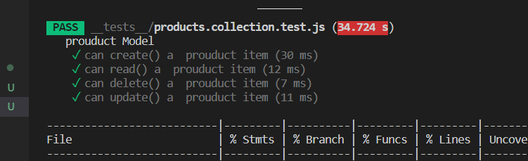
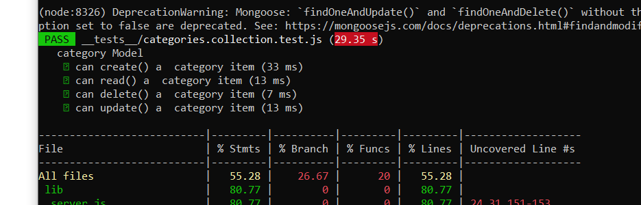
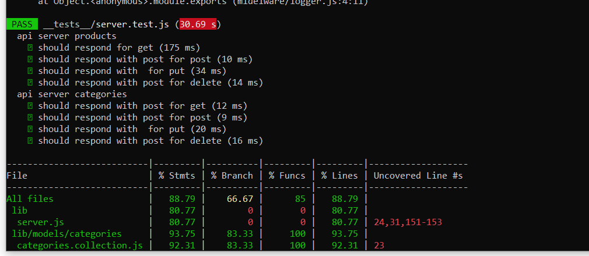
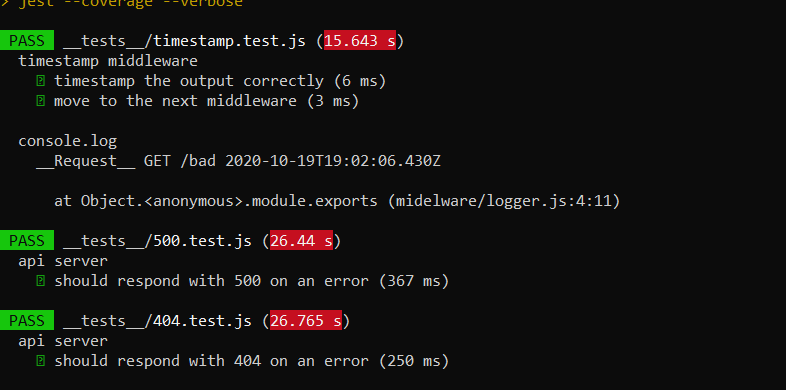
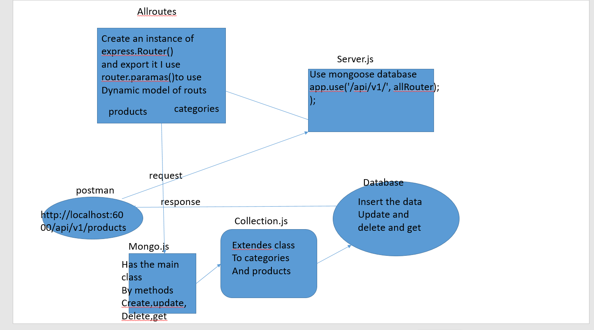

LAB - 9

Author: bayan alalem

Setup
`.env `requirements
PORT - Port Number
`npm i -D jest ` `npm init -y` `npm i express` `npm i supertest` `npm i mongoose morgn cors` 

## detailes about files

1. mongo.js
This will serve as the “master” class for Mongo data collections.
2. allroute.js
 In this middleware, dynamically` require() `the data model specified by the model parameter:
Identify a valid model in the route param

we made  that model available to the handler functions so that they can still call, for example, `request.model.create()
 
**refactores our code**
## Running the app

`npm start`

Endpoint:`/products`

method:post
Returns Object

`{`
`  "name": "john-api-server.demo.herokuapp.com",`
`  "catogry": "running",`
`  "description": "color of skirt blue",`
 ` "id":1`
`}`
Endpoint:`/products`
method:get
Returns Object

`{`
    `"count": 1,`
   ` "results": {`
       ` "categories": [`
           ` {`
                `"name": "bayan3",`
               ` "display_name": "display_name,description",`
                `"description": "DD",`
               ` "id": 1`
            `}`
       ` ],`
        `"products": [`
           `  {`
               ` "name": "bayan3",`
                `"catogery": "display_name,description",`
               ` "description": "DD",`
               ` "id": 1`
           ` }`
        `]`
    `}`
`}`

Endpoint:`/products/1`
method:put
Returns Object

`{`
  `"name": "john-api-server.demo.herokuapp.com",`
 ` "catogry": "running",`
 ` "description": "color of skirt orange",`
 ` "id":1`
`}`

Endpoint:`/products/1`
method:`delete`
Returns Object

`{`
`}`

Endpoint:`/categories`

method:post
Returns Object

`{`
`  "name": "john-api-server.demo.herokuapp.com",`
`  "catogry": "running",`
`  "description": "color of skirt blue",`
 ` "id":1`
`}`
Endpoint:`/categories`
method:get
Returns Object

`{`
    `"count": 1,`
   ` "results": {`
       ` "categories": [`
           ` {`
                `"name": "bayan3",`
               ` "display_name": "display_name,description",`
                `"description": "DD",`
               ` "id": 1`
            `}`
       ` ],`
        `"categories": [`
           `  {`
               ` "name": "bayan3",`
                `"catogery": "display_name,description",`
               ` "description": "DD",`
               ` "id": 1`
           ` }`
        `]`
    `}`
`}`

Endpoint:`/categories/1`
method:put
Returns Object
    ` {`
                `"name": "bayan3",`
               ` "display_name": "display_name,description",`
                `"description": "DD",`
               ` "id": 1`
            `}`

Endpoint:`/categories/1`
method:`delete`
Returns Object

`{`
`}`

Tests
Unit Tests: npm run test

UML Diagram
